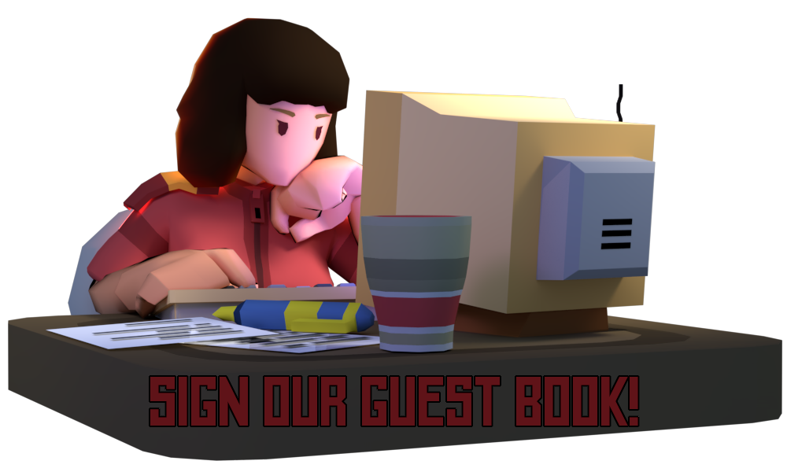

<h3 align="center">
    
    
    
Space Station 3D is a 3D remake of the classic "Space Station 13".

</h3>

<!-- New typing images can be generated at: https://readme-typing-svg.demolab.com/demo/ -->

  
<h2>Contact</h2>

  

    
     Gmail
  
&nbsp;
  &nbsp;
  

<!-- This page can be automated to update after a given period to include -->
<!-- our most recent tweets, youtube videos, and/or github stats. -->

  

  

